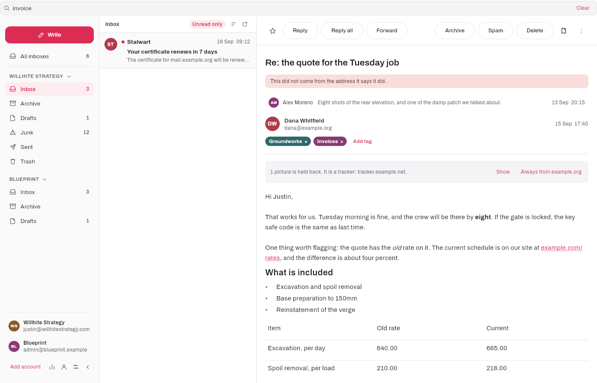
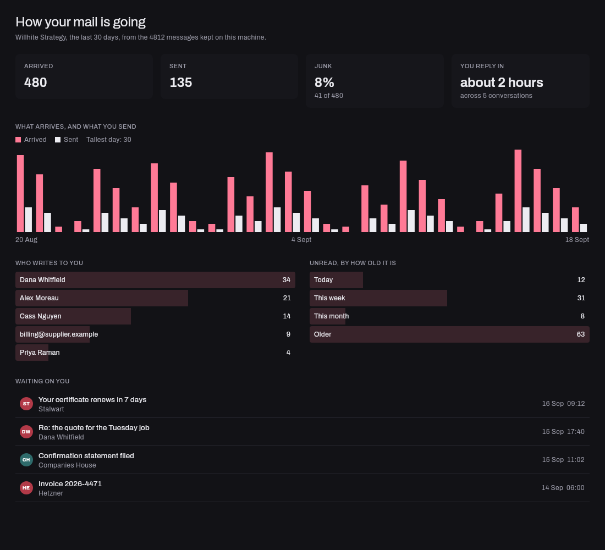
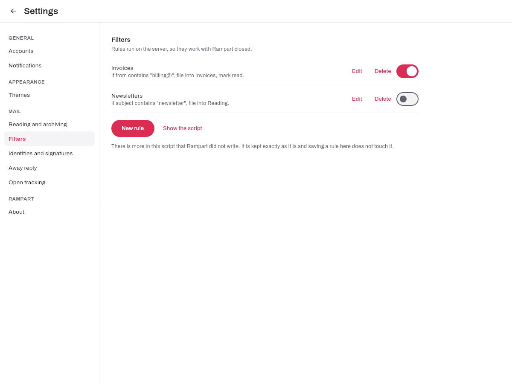
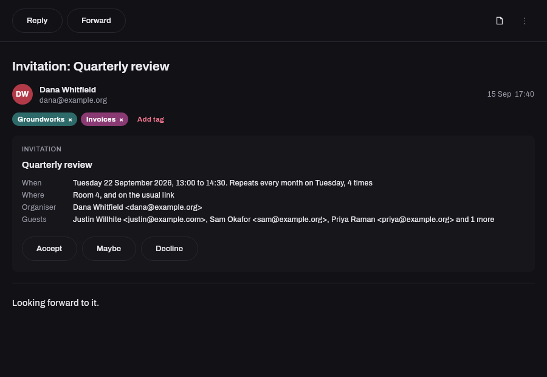
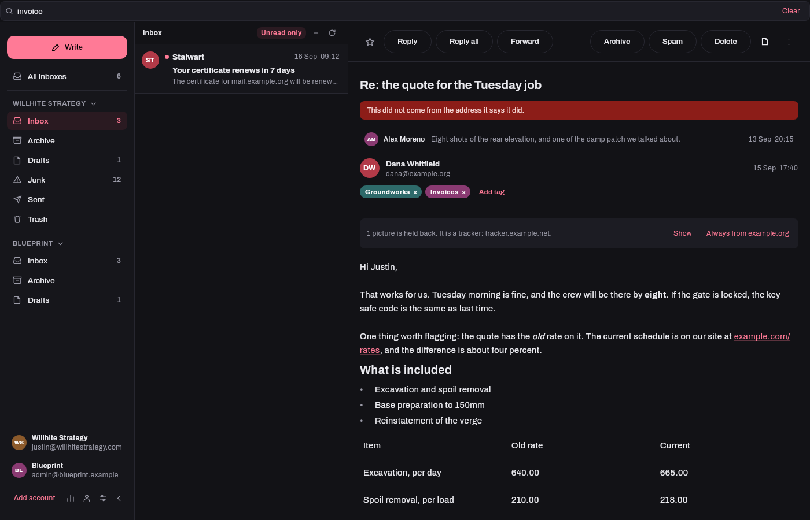

<div align="center">


### Your mail and your whole mail server, in one native desktop window.

[](https://github.com/thejdubb02/rampart/releases/latest)
[](LICENSE)


</div>

<p align="center">
  
</p>

Rampart is a desktop mail client that treats your mail server as part of the application
rather than as something you go and configure in a browser.

**Type your email address and it finds the rest.** It asks what your domain publishes
about itself, tries [JMAP](https://jmap.io) first and falls back to IMAP, and signs in
with the first server that answers. There is a box for the hostname if your domain says
nothing, and most people will never open it.

## Built for Stalwart

Rampart is designed against [Stalwart](https://stalw.art) first, and if that is your mail
server this is a client built with it in mind. Stalwart speaks JMAP, and JMAP is what
makes the second half of this application possible: **your account settings and your
server settings, managed from the same window as your mail.**

IMAP can move messages and very little else. It has no way to carry your filter rules,
your aliases, your vacation responder, your app passwords or your server's own
configuration, so every IMAP client, however good it is, leaves nine tenths of a modern
mail server invisible and sends you to a browser for the rest.

| | Today | Being built |
|---|---|---|
| **Mail** | Read, write, send, search, file, offline | |
| **Your account** | Sieve filter rules with a builder, vacation responder, signatures, contacts, quota | App passwords, API keys, aliases |
| **Your server** | | Accounts, domains, DKIM, the mail queue, certificates, TLS, listeners, logs |

The account and server screens are rendered from the server's own published schema rather
than hand written, so they stay correct when Stalwart adds a field. See
[docs/architecture.md](docs/architecture.md).

**And it works on anything else.** Reading, writing, sending, searching, folders,
attachments and flags all work against any IMAP and SMTP server that takes a password.
What the protocol cannot do is absent with a sentence saying why, never a button that
fails. That is the difference between a mail client you can recommend to somebody and one
that only works if they run the same server you do.

## What it does today

**Reading.** Threaded conversations, a unified inbox across accounts, instant offline
search, push over the JMAP WebSocket. HTML drawn as blocks, with a browser engine only
where a message genuinely needs one. Pictures in the flow, remote images held per sender,
links confirmed before they open.

**Knowing what a message is.** A word above anything that cannot prove who sent it, from
the SPF, DKIM and DMARC results the server already recorded. Trackers named rather than
silently blocked. One-click unsubscribe, view source, save as `.eml`.

**Writing.** Bold, italic, links, lists and inline pictures. Recipient autocomplete from
your address book and your own mail history. Templates that fill placeholders from the
recipient. Read receipts, requested and answered as a draft rather than a message that
sends itself. Undo-send on a timer you choose.

**Keeping a mailbox.** Star, tag, archive, spam, trash, one at a time or in a batch, all
undoable. Snooze a message until later. Create, rename, nest and delete folders. Filters
as Sieve, built in the UI or written by hand, in the format your webmail already reads.

**Calendar invitations** answered in place, **contacts** on the server, **a dashboard**
that counts what is already in the mailbox, and **open tracking** switched on one message
at a time and never by default.

<p align="center">
  
  
</p>
<p align="center">
  
  
</p>

Eighteen themes, the window's title bar included. Keyboard shortcuts with the list on `?`,
a command palette on Ctrl+K, passwords in the operating system's credential store, and it
updates itself.

## Install it

On Windows, paste this into PowerShell:

```powershell
irm https://github.com/thejdubb02/rampart/releases/latest/download/install.ps1 | iex
```

It trusts our signing certificate, installs Rampart and starts it. One admin prompt, the
first time on each machine, and every update after that is silent.

Do not double-click the `.msix` file. Rampart is signed with our own key rather than a
certificate from a public authority, and Windows will not install a package whose signer
it does not know yet, so App Installer opens, cannot finish, and its Cancel button does
nothing. A real code signing certificate removes that step and costs a few hundred dollars
a year, which is worth it when Rampart is something other people install.

On Linux, take the `.deb` from the
[latest release](https://github.com/thejdubb02/rampart/releases/latest).

macOS is not built yet: an unnotarised build is worse than none, and notarising needs a
paid Apple account.

## The optional companion server

Rampart needs a mailbox and nothing else. One feature genuinely cannot work from a desktop
application alone, which is knowing whether a message you sent was opened, because that
needs somewhere on the web a picture can be fetched from.

That server is in [`server/`](server/), it is a container and a token, and it stores a
random id, a timestamp, a user agent and a truncated network per fetch. It never sees a
message, a subject, a recipient or your password. If you do not want it, open tracking is
switched off and Rampart does not ask again.

## Setting it up for someone else

Most people need nothing here: an address and a password is the whole setup.

For the ones whose domain publishes nothing, Rampart also reads a short file listing which
servers to offer, so signing in is a click and a password rather than a conversation about
hostnames. It holds a name, a server, an address and which protocol worked, and it cannot
hold a password: Rampart reads those fields and drops everything else. There is a template,
and a block you can hand to an assistant to fill in for you, in
[docs/connecting.md](docs/connecting.md).

If you run the mail server, publishing three DNS records means nobody has to do any of
this, in Rampart or in Thunderbird, Apple Mail or Outlook, all of which read them too:
`_jmap._tcp`, `_imaps._tcp` and `_submissions._tcp` (RFC 6186 and RFC 8314).

## On your phone

Use [Sterna Mail](https://sternamail.org/). It is a native Android JMAP client, free
software, on F-Droid, and it is good. Rampart does not duplicate it.

## Building it

JDK 21 and nothing else. The Gradle wrapper fetches the rest.

```bash
./gradlew run          # start it
./gradlew test         # 650-odd tests, no network
```

[docs/roadmap.md](docs/roadmap.md) is what is being built next and why, in order.
[docs/architecture.md](docs/architecture.md) is how it is put together.

## Licence

Apache 2.0. See [LICENSE](LICENSE).

Rampart builds on [jmap-mua](https://codeberg.org/iNPUTmice/jmap) by Daniel Gultsch,
Apache 2.0, and takes reference from his
[Ltt.rs](https://codeberg.org/iNPUTmice/lttrs-android).
